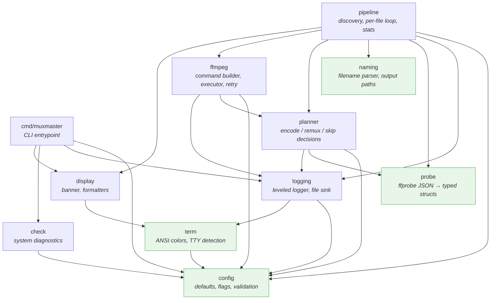

# Architecture

Package dependency map for the Muxmaster Go project. Dependencies flow top-down; leaf packages have zero internal dependencies.

---

## Package dependency diagram



Green-highlighted packages are **leaf packages** with no or minimal internal dependencies — the safest starting points for implementation and testing.

---

## Dependency rules

- **config** depends on nothing internal.
- **term** depends only on config (reads ColorMode enum).
- **logging** depends on config + term. It calls `term.Configure` once; thereafter reads color variables at log-write time.
- **display** depends on term (for banner coloring) — **not** on logging. This decouples presentation from the logger.
- **probe** and **naming** stay dependency-free (pure logic + external tool wrappers).
- **planner** combines config + probe data to produce a `FilePlan`.
- **ffmpeg** depends on config and planner (consumes `FilePlan`).
- **pipeline** is the sole orchestrator — it wires probe, naming, planner, ffmpeg, and display into the per-file processing loop.
- **check** depends only on config; it accepts a small Logger interface.

---

## Per-file processing flow

```
pipeline.Run
  │
  ├─ 1. Validate input file (readable, not too small)
  ├─ 2. probe.Probe(path) → ProbeResult
  ├─ 3. naming.ParseFilename(basename) → ParsedName
  ├─ 4. naming.OutputPath(ParsedName) → output path
  ├─ 5. naming.ResolveCollision(input, output) → final path
  ├─ 6. display.LogFileStats(ProbeResult)
  ├─ 7. planner.BuildPlan(Config, ProbeResult) → FilePlan
  ├─ 8. display.LogRenderPlan(FilePlan)
  ├─ 9. ffmpeg.Execute(FilePlan) with retry loop
  └─ 10. Update RunStats (encoded / skipped / failed)
```

For full type definitions and behavioral detail, see [design/foundation-plan.md](design/foundation-plan.md).
