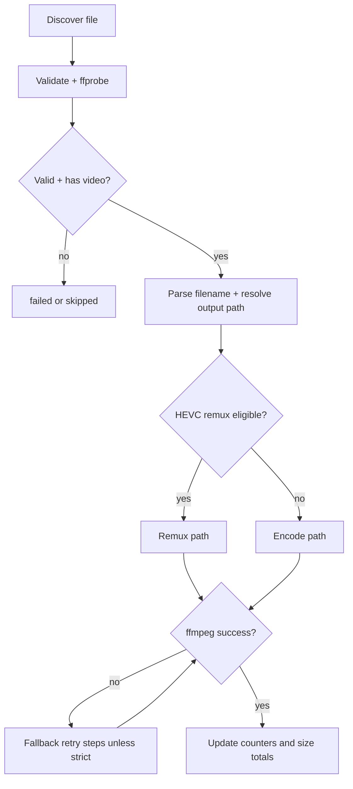

# Muxmaster Current-Behavior Design (Legacy Bash)

Status: Reverse-engineered from `Muxmaster.sh` (v1.7.0)  
Scope: Observable behavior only (no feature redesign)

## 0) AI Ingestion Notes

Use this document as a behavior contract for implementation agents:

1. Preserve behavior unless explicitly marked "rewrite mapping."
2. When this doc and comments disagree, script behavior wins.
3. Terms used consistently:
   - **Encode path** = video re-encode (`hevc_vaapi` or `libx265`)
   - **Remux path** = video copy (`-c:v copy`) with audio/subtitle/attachment handling
   - **Strict mode** = disable automatic ffmpeg fallback retries
4. Boolean defaults are literal script defaults (`true`/`false`), not recommendations.

---

## 1) Purpose & System Overview

### What the script does
`Muxmaster.sh` is a CLI batch media processor that generates Jellyfin-compatible output:

- Video target: HEVC (VAAPI or CPU x265)
- Audio target: copy AAC when already AAC; transcode other codecs to AAC
- Container target: MKV (default) or MP4
- Metadata/chapters: copied from source

### Primary responsibilities
- Discover media files under an input directory.
- Parse filenames into TV/movie naming targets.
- Probe stream attributes with `ffprobe`.
- Choose per-file action:
  - remux HEVC-safe sources, or
  - transcode video.
- Execute ffmpeg with bounded fallback retries.
- Summarize results and aggregate size delta.

### Overall workflow model
Single process, sequential file handling, deterministic file order (`find ... | sort -z`), global mutable state.

---

## 2) Execution Model

### Entry point
`main "$@"` executes:

1. `init_colors`
2. `parse_args`
3. `init_colors` again (applies parsed color mode)
4. `print_banner`
5. `--check` short-circuit (`run_check`, exit 0)
6. Input/output path checks
7. `check_deps`
8. `process_files`

### CLI shape
`Muxmaster.sh [OPTIONS] <input_dir> <output_dir>`  
`--check` mode does not require positional directories.

### Effective default runtime profile

| Setting | Default |
|---|---|
| Encoder mode | `vaapi` |
| VAAPI device | `/dev/dri/renderD128` (auto-fallback to first render device if missing) |
| VAAPI quality | `QP=19` |
| CPU quality | `CRF=19`, preset `slow` |
| Output container | `mkv` |
| Audio target | up to 2 channels, AAC `256k`, 48kHz |
| Keep subtitles | `true` |
| Keep attachments | `true` |
| Skip existing output | `true` |
| Skip HEVC re-encode | `true` |
| Smart quality | `true` |
| Clean timestamps | `true` |
| Match audio layout | `true` |
| HDR handling | `preserve` |
| Deinterlace auto-detect | `true` |
| ffmpeg stats display | `true` |

### Option precedence and derived runtime values

1. Mode-specific quality flags (`--cpu-crf`, `--vaapi-qp`) override `--quality` for matching mode.
2. `ACTIVE_QUALITY_OVERRIDE` is set only when a manual quality override applies to active mode.
3. `--verbose` sets ffmpeg loglevel to `info`; otherwise `error`.
4. ffmpeg live stats are enabled if `--verbose` **or** `--show-fps`.
5. `--force` disables skip-existing behavior.

### Batch processing strategy
- No parallel workers.
- Per-file counters: encoded, skipped, failed.
- Per-file outcomes do not abort batch.
- Temp files are globally tracked and removed via `trap` on `EXIT/INT/TERM`.

---

## 3) Media Processing Pipeline (Per File Lifecycle)

### Discovery
- Root: `INPUT_DIR`
- Include extensions (case-insensitive): `mkv|mp4|avi|m4v|mov|wmv|flv|webm|ts|m2ts|mpg|mpeg|vob|ogv`
- Exclude subtrees named `extras` (case-insensitive)
- Sort discovered files deterministically

### Filename normalization and classification
- `parse_filename` applies ordered regex rules (first match wins).
- Output fields set in globals: `MEDIA_TYPE`, `SHOW_NAME`, `SEASON`, `EPISODE`, `MOVIE_NAME`, `YEAR`.
- Normalization includes:
  - release-tag stripping,
  - bracket metadata cleanup,
  - separator cleanup and title-casing,
  - fallback names (`Unknown`) when needed.
- TV names may be harmonized by year-variant index built across the whole batch.

### Media inspection (`ffprobe`)
For each valid file, script probes:

- primary video stream index (ignores attached pictures),
- codec/profile/pixel format,
- resolution and bitrate,
- audio stream count, codec, channels,
- subtitle codec list (bitmap detection),
- interlace field order,
- color metadata (`color_transfer`, `color_primaries`, `color_space`) for HDR detection.

### Decision matrix (per file)

| Condition | Action |
|---|---|
| file invalid/unreadable/unprobeable | mark failed, continue |
| no video stream | mark skipped, continue |
| `SKIP_HEVC=true` and primary codec is HEVC and profile/pix_fmt is edge-safe | remux path |
| otherwise | encode path |
| output exists and `SKIP_EXISTING=true` | skip before running ffmpeg |

Edge-safe HEVC check: profile in `{main, main10}` and pixel format in `{yuv420p, yuv420p10le}`.

### FFmpeg invocation strategy
- Remux path: copy video; process audio/subtitle/attachment streams by rules below.
- Encode path: re-encode video to HEVC with selected quality; same stream rules for non-video streams.
- MP4 output adds `-movflags +faststart` and `-tag:v hvc1`.

### Output naming and placement
- TV: `<OUTPUT_DIR>/<Show>/Season <NN>/<Show> - S<NN>E<NN>.<container>`
- Movie: `<OUTPUT_DIR>/<MovieOrMovieYear>/<MovieOrMovieYear>.<container>`
- In-run path collisions are remapped to `... - dupN.<ext>` using owner/counter maps.

### Idempotency and skip behavior
- Existing-output skip is default (`--force` disables it).
- Dry-run logs intended operations and reports success without writing outputs.
- Failed ffmpeg attempts remove partial output files.

---

## 4) Functional Breakdown

| Group | Key functions | Responsibility | Inputs / Outputs | Side effects / dependencies |
|---|---|---|---|---|
| CLI/config | `parse_args`, `usage`, `require_option_value` | Parse/validate options and set globals | args -> global settings | may `exit 1` |
| Logging/UI | `init_colors`, `print_banner`, `log_*` | Leveled logs + optional color/file output | message -> stdout/stderr/log file | depends on `LOG_FILE`, color mode |
| Dependency checks | `check_deps`, `run_check` | Validate ffmpeg/ffprobe and encoder capability | environment -> pass/fail | may `exit 1` |
| Probe layer | `get_*`, `detect_hdr_type`, `is_interlaced` | Extract media and stream properties | file -> scalar values | `ffprobe` subprocess calls |
| Parse/naming | `parse_filename`, `get_output_path`, `harmonize_tv_show_name` | Classify media and compute output path | filename/path -> naming globals/path | updates parse globals |
| Collision handling | `resolve_output_path_for_input` | Avoid duplicate output targets in same run | input + requested path -> resolved path | mutates owner/counter maps |
| Plan building | `build_video_filter`, `build_audio_opts`, `build_subtitle_opts`, `compute_smart_quality_settings` | Produce ffmpeg option fragments and quality selections | input + config -> option strings/values | depends on global flags |
| FFmpeg execution | `run_encode_attempt`, `run_remux_attempt`, `run_ffmpeg_logged` | Build and execute ffmpeg commands | plan + paths -> exit status | writes outputs/temp stderr logs |
| Orchestration | `encode_file`, `process_files` | Retry policy, counters, summaries | input set -> batch result | file I/O, directory creation, deletion |

---

## 5) FFmpeg Strategy

### Shared command shape
Both remux and encode invocations include:

- `-hide_banner -nostdin -y`
- `-loglevel $FFMPEG_LOGLEVEL`
- optional stats args (`-stats -stats_period 1`)
- `-probesize 100M -analyzeduration 100M -ignore_unknown`
- optional timestamp pre-input flags (`-fflags +genpts+discardcorrupt`)
- explicit `-map` rules
- `-dn -max_muxing_queue_size <value> -max_interleave_delta 0`
- `-map_metadata 0 -map_chapters 0`
- optional `-avoid_negative_ts make_zero`

### Video codec decisions

| Mode | Encoder settings |
|---|---|
| `vaapi` | `-init_hw_device vaapi=va:<dev> -filter_hw_device va -c:v hevc_vaapi -qp <qp> -profile:v <VAAPI_PROFILE> -g 48` |
| `cpu` | `-c:v libx265 -crf <crf> -preset <preset> -profile:v main10 -pix_fmt yuv420p10le -g 48 -x265-params log-level=error:open-gop=0` |
| remux | `-c:v copy` |

### Video filter chain rules
`build_video_filter` may add, in order:

1. `yadif=...` when interlaced and `DEINTERLACE_AUTO=true`
2. HDR tonemap chain when HDR detected and `HANDLE_HDR=tonemap`
3. `format=<VAAPI_SW_FORMAT>,hwupload` when mode is VAAPI

When preserving HDR (`HANDLE_HDR=preserve`), encode path attempts to forward color metadata flags (`-color_trc`, `-color_primaries`, `-colorspace`) if known.

### Audio mapping and conversion rules

| Input audio state | Behavior |
|---|---|
| no audio streams | `-an` |
| all streams AAC | map all audio and `-c:a copy` |
| mixed codecs | per-stream mapping: copy AAC streams, transcode non-AAC to AAC (`48kHz`, `256k`, channel cap at 2) |

If `MATCH_AUDIO_LAYOUT=true`, encoded audio streams get `aresample/aformat` filters; mono/stereo layouts are explicitly set for 1/2 channels.

### Subtitle and attachment rules

| Condition | Subtitles | Attachments |
|---|---|---|
| disabled by flags | not mapped | not mapped |
| MKV output | `-map 0:s? -c:s copy` | `-map 0:t? -c:t copy` (if enabled) |
| MP4 output + text subs | `-map 0:s? -c:s mov_text` | disabled |
| MP4 output + any bitmap subs | subtitles skipped | disabled |

### Retry/error handling patterns

Retry bound: max 4 ffmpeg attempts per path, unless strict mode (no adaptive retries).  
Fallback sequence when stderr pattern matches:

1. remove attachments
2. remove subtitles
3. increase mux queue (`4096 -> 16384`)
4. enable timestamp fix

Encode path has extra quality pass logic:

- Up to 2 quality passes total.
- If output ratio > 105% and smart quality is active without manual override:
  - increase CRF and QP by +2 (clamped),
  - rerun encode path once more.

---

## 6) State & Error Model

### Global state model

| Category | Examples |
|---|---|
| Runtime config | `ENCODER_MODE`, `OUTPUT_CONTAINER`, `SKIP_HEVC`, `SMART_QUALITY`, `STRICT_MODE` |
| Quality controls | `VAAPI_QP`, `CPU_CRF`, override fields, `ACTIVE_QUALITY_OVERRIDE` |
| Parse/output fields | `MEDIA_TYPE`, `SHOW_NAME`, `SEASON`, `EPISODE`, `MOVIE_NAME`, `YEAR`, `RESOLVED_OUTPUT_PATH` |
| Collections/maps | `TEMP_FILES`, `TV_SHOW_YEAR_VARIANTS`, `OUTPUT_PATH_OWNERS`, `OUTPUT_PATH_COLLISION_COUNTER` |

### Failure handling behavior
- Script uses explicit return checks (`set -o pipefail`; not `set -e`).
- Startup/config failures exit immediately (`exit 1`).
- File-level failures are counted and batch continues.
- Temp file cleanup always attempted via trap.

### Exit-code behavior
- `0` on normal completion (including `--check` mode).
- `1` on startup validation errors (args, directories, deps, mode/container/HDR validation, VAAPI/libx265 checks).
- Batch can still exit `0` when some files failed.

### Logging model
- Levels: `INFO`, `SUCCESS`, `WARN`, `ERROR`, `RENDER`, `OUTLIER`, `DEBUG`.
- `ERROR` level writes to stderr.
- Optional file log mirrors uncolored lines.
- `run_ffmpeg_logged`:
  - verbose/fps mode: stderr is teed to console + error file,
  - quiet mode: stderr goes only to error file.
- Final failure logs show tail of captured ffmpeg stderr.

### Operational invariants
- Output directory must not be inside input directory.
- Primary video stream excludes attached pictures.
- MP4 always forces `hvc1` tag and disables attachments.
- Existing outputs are skipped by default.

---

## 7) Structural Weaknesses (Observed)

- Heavy global-state coupling across functions.
- Single large script with mixed concerns (CLI, parsing, probing, execution, reporting).
- Order-sensitive regex cascade in filename parsing.
- Duplicate retry logic branches for remux and encode paths.
- Bash string/array assembly for ffmpeg arguments increases quoting/splitting risk.

---

## 8) Go Rewrite Mapping (Behavior-Preserving)

### Suggested package structure
- `cmd/muxmaster` (CLI entrypoint)
- `internal/config` (defaults, parsing, validation, precedence)
- `internal/logging` (levels, color policy, file sink)
- `internal/probe` (`ffprobe` wrappers + typed results)
- `internal/naming` (filename parsing, output path builder, collision resolver)
- `internal/planner` (remux/encode decisions, quality selection, stream plans)
- `internal/ffmpeg` (command builders, executor, stderr classifiers)
- `internal/pipeline` (batch orchestration + counters)
- `internal/report` (summary output)

### Core structs
- `Config`
- `MediaProbe` (video/audio/subtitle/HDR/interlace metadata)
- `ParsedName` (tv/movie naming fields)
- `OutputPathPlan` (requested + resolved paths)
- `FilePlan` (`EncodePlan` or `RemuxPlan`)
- `RetryState`
- `RunStats`

### Pipeline model
Represent current behavior as explicit sequential stages:

1. discover files
2. validate and probe
3. parse naming + resolve path
4. build plan (encode/remux/skip)
5. execute with retry/fallback policy
6. collect stats and report

### Concurrency approach
- Start sequential for parity.
- If concurrency is added later, preserve deterministic logs and collision-resolution semantics.

### Logging and error model
- Typed errors for retry classes (attachment, subtitle, mux queue, timestamp).
- Keep batch continuation behavior: fail-file, continue-run.
- Maintain current exit behavior (`0` even with per-file failures, unless startup validation fails).
