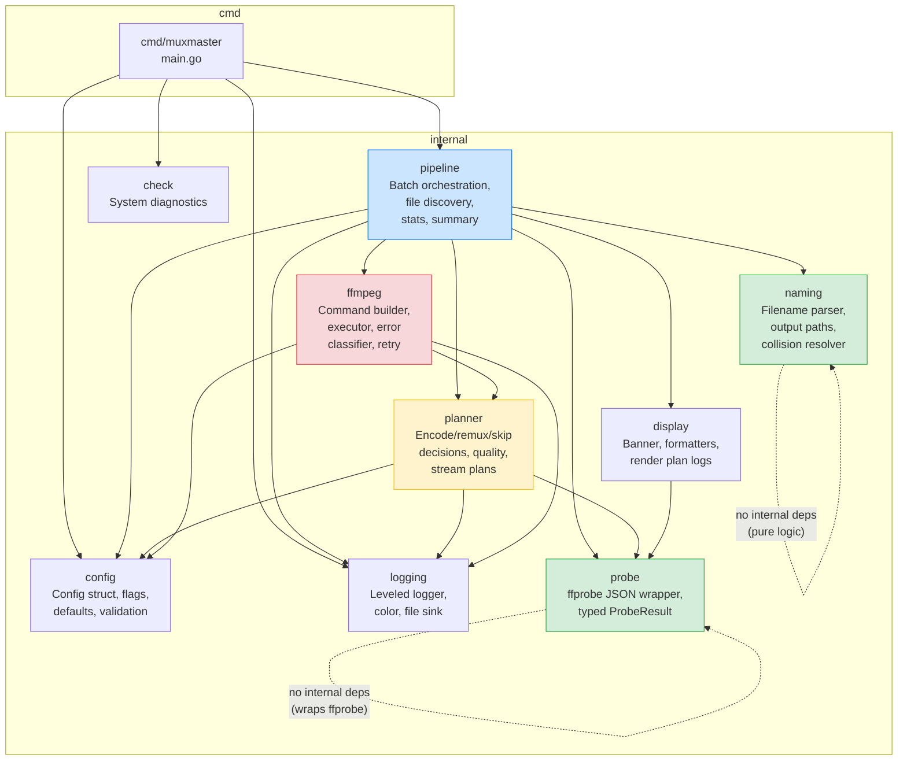
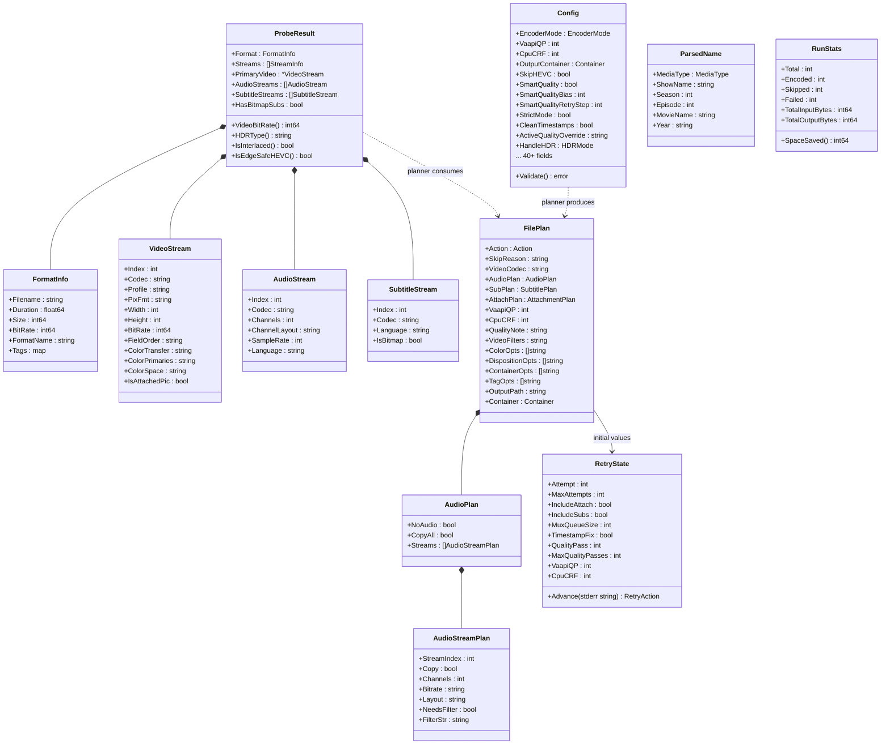
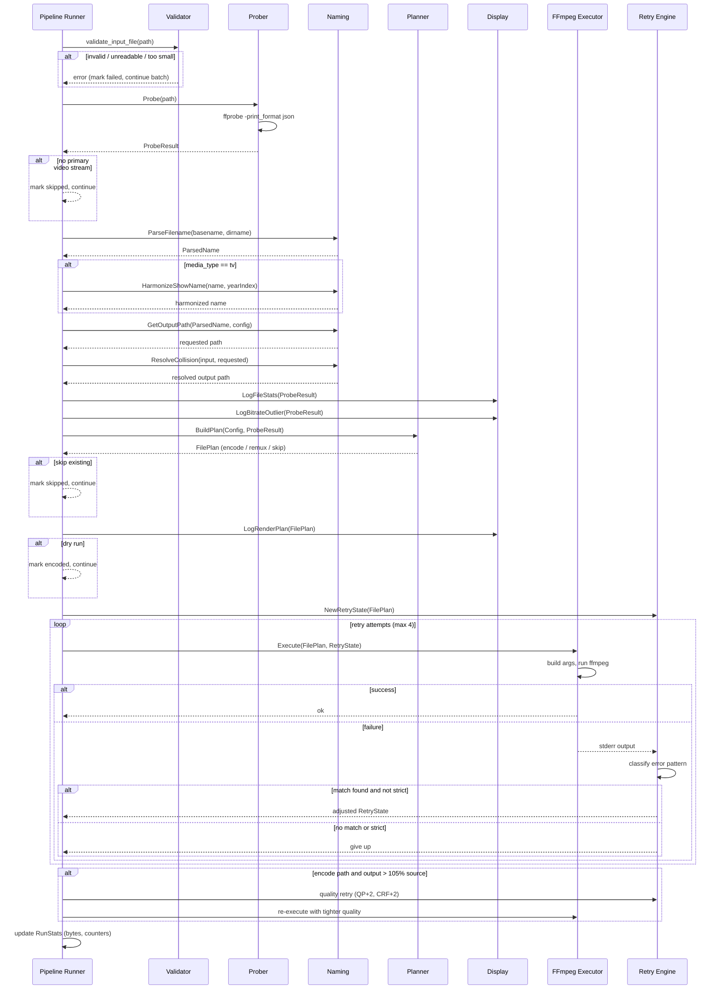
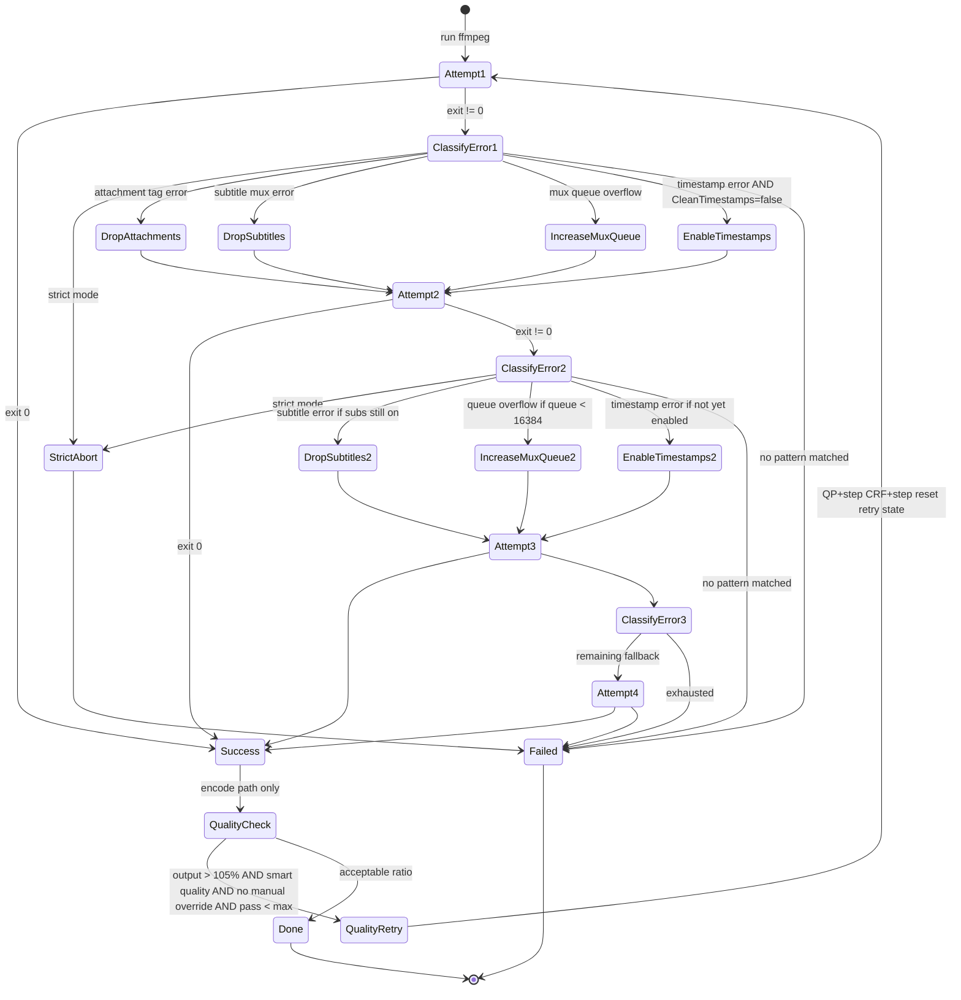
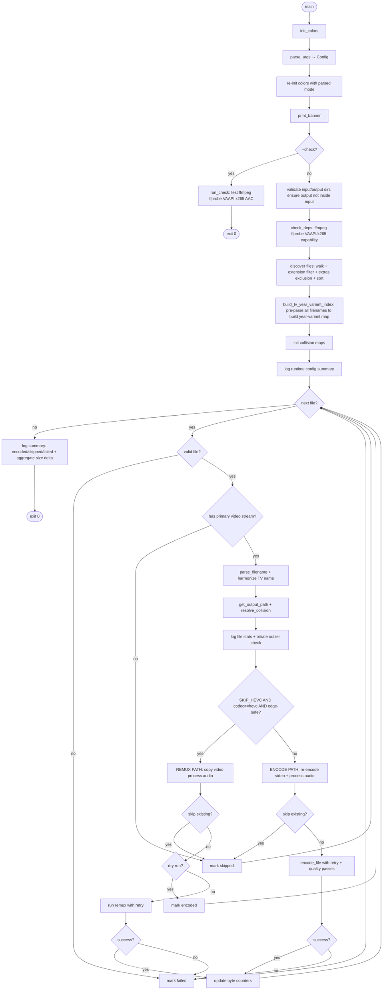
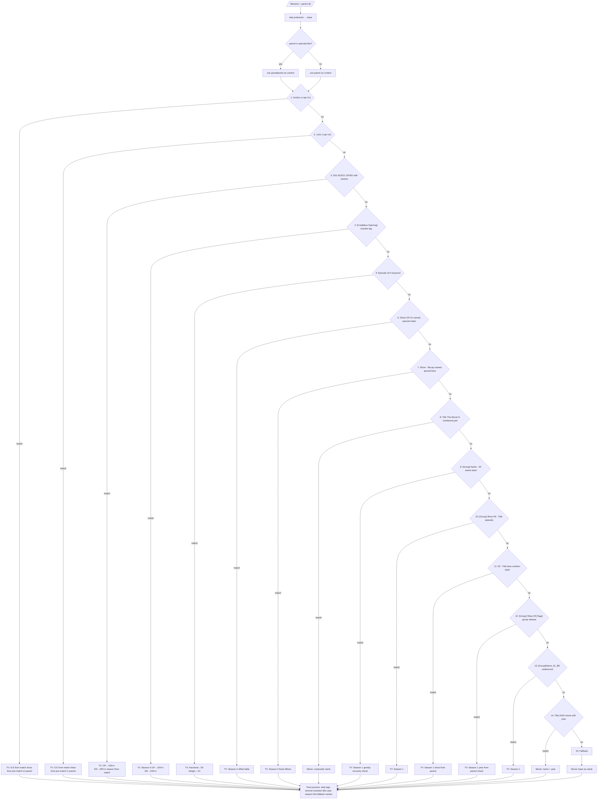

# Muxmaster Go Rewrite — Foundation Plan (Final)

**Status:** Pre-implementation — all foundational decisions resolved  
**Scope:** Architecture, repository structure, technical decisions, migration strategy  
**Audience:** Developer (Go beginner), maintainer  

---

## 1. Executive Summary

This plan defines the foundational steps for rewriting Muxmaster from a 2,666-line Bash script (v1.7.0) into a production-grade Go CLI application (v2.0). It bridges the gap between the existing behavior contract (current-behavior design doc) and the aspirational 2.0 design doc, establishing concrete decisions about what to build first, how to structure it, and what to defer.

The rewrite targets a single static binary for Arch Linux, preserving all current behavior while introducing the structural improvements described in the 2.0 design: typed domain objects, interface-driven dependencies, structured logging, and a persistent state store.

---

## 2. Resolved Decisions Summary

| Decision | Resolution | Rationale |
|---|---|---|
| Module path | `github.com/<user>/muxmaster` | Standard Go convention; works locally too |
| Go version | 1.23+ minimum | Latest stable on Arch; gives `slog`, `slices`, range-over-int |
| CLI framework | Standard `flag` | No external deps; migrate to `cobra` when subcommands arrive |
| External deps | Zero for MVP | Entire standard library covers needs |
| ffprobe strategy | Single JSON call per file | Replaces ~10 subprocess calls; biggest reliability win |
| Primary container | MKV (MP4 rarely used) | MP4 support preserved for parity; lower testing priority |
| Anime naming patterns | All 15 rules active | Parser test suite needs 60+ cases |
| Smart quality bias | Configurable constant (default `-1`) | `SmartQualityBias` in Config; quality retry step (`+2`) also configurable |
| Title-casing | Capitalize every word (match shell) | Simple parity; swap to proper title-case post-MVP if desired |
| Logging | Custom leveled logger | Migrate to `log/slog` when JSON mode is added |
| Retry logic | Single unified state machine | Replaces duplicated remux/encode retry loops in shell |
| Formatting | `gofmt` + `go vet` | Standard Go toolchain; no custom lint rules |
| Exit code 2 (partial failure) | Deferred to post-MVP | Shell exits `0` on partial failure; change behavior alongside subcommand CLI |
| Config file (YAML) | Deferred to post-MVP | Evaluate TOML (`BurntSushi/toml`) vs YAML at that time |

### Open Items (Resolve Before Phase 4)

| Item | Impact | Default if unresolved |
|---|---|---|
| **Test corpus** | Integration tests in Phase 4 need real or synthetic media files. Synthetic (1-second black video, various codecs/streams) works for CI but won't catch real-world naming edge cases. | Generate synthetic files; use real library for manual parity testing |
| **GitHub username** | Needed for `go mod init` | Use placeholder; `go mod edit -module` can rename later |

---

## 3. Scope Boundaries

### In Scope (MVP)

- Full CLI parity with v1.7.0 flags and behavior
- Sequential file processing (no concurrency)
- `ffprobe` JSON probing with typed structs
- Encode path (VAAPI + CPU) and remux path
- Filename parsing and Jellyfin-compatible output naming (all 15 regex patterns)
- Smart quality adaptation, bitrate estimation model, retry/fallback logic
- Collision resolution for duplicate output paths
- TV show year-variant harmonization (two-pass file discovery)
- Stream disposition management (default video + first audio)
- Dry-run mode
- `--check` system diagnostics mode
- Colored + leveled logging (text mode)
- Log file output
- Temp file / partial output cleanup on signals
- Exit code behavior matching v1.7.0

### Deferred (Post-MVP)

- Subcommand architecture (`scan`, `plan`, `run`, `verify`, `stats`)
- Persistent state store (SQLite/BoltDB) and resumability
- JSON structured logging (`--json`)
- Config file (`~/.config/muxmaster/config.yaml`)
- Environment variable config layer
- Output verification (probe-after-write)
- Atomic rename strategy (write to temp → verify → rename)
- Disk space preflight check
- Parallel workers
- systemd integration and hardening
- Exit code `2` for partial failure

### Rationale

The 2.0 design doc is ambitious and well-structured, but it introduces several new behaviors simultaneously (subcommands, state store, atomic output, verification). For a big-bang rewrite by a Go newcomer, the safest path is to first achieve behavioral parity with the shell script in idiomatic Go, then layer on 2.0 features incrementally. This gives you a working, testable baseline at every stage.

---

## 4. UML Diagrams

### 4.1 Package / Component Diagram



### 4.2 Core Struct Relationships (Class Diagram)



### 4.3 Per-File Processing Sequence Diagram



### 4.4 Retry State Machine



### 4.5 Batch Processing Activity Diagram



### 4.6 Filename Parser Rule Cascade



---

## 5. Repository Structure

```
muxmaster/
├── cmd/
│   └── muxmaster/
│       └── main.go                  # Entrypoint: parse args, wire deps, run
│
├── internal/
│   ├── config/
│   │   ├── config.go                # Config struct, defaults, validation
│   │   ├── flags.go                 # CLI flag parsing (maps to Config)
│   │   └── config_test.go
│   │
│   ├── logging/
│   │   ├── logger.go                # Leveled logger, color policy, file sink
│   │   └── logger_test.go
│   │
│   ├── probe/
│   │   ├── prober.go                # Prober interface + ffprobe implementation
│   │   ├── types.go                 # ProbeResult, VideoStream, AudioStream, etc.
│   │   ├── hdr.go                   # HDR detection from color metadata
│   │   ├── interlace.go             # Interlace detection from field_order
│   │   └── probe_test.go
│   │
│   ├── naming/
│   │   ├── parser.go                # Rule evaluation loop + specials-folder context
│   │   ├── rules.go                 # All 15 ordered regex rules as ParseRule table
│   │   ├── postprocess.go           # Tag stripping, title-casing, season hints
│   │   ├── outputpath.go            # ParsedName → output path builder
│   │   ├── collision.go             # In-run duplicate path resolver
│   │   ├── harmonize.go             # TV show year-variant harmonization
│   │   └── parser_test.go           # 60+ table-driven test cases
│   │
│   ├── planner/
│   │   ├── planner.go               # Per-file decision: encode / remux / skip
│   │   ├── quality.go               # Smart quality computation (configurable bias)
│   │   ├── estimation.go            # Output bitrate estimation (ratio tables, biases)
│   │   ├── audio.go                 # Per-stream audio plan (copy AAC / transcode / filters)
│   │   ├── subtitle.go              # Subtitle + attachment stream plans
│   │   ├── filter.go                # Video filter chain (deinterlace, HDR, hwupload)
│   │   ├── disposition.go           # Stream disposition flag builder
│   │   └── planner_test.go
│   │
│   ├── ffmpeg/
│   │   ├── builder.go               # Shared skeleton + encode/remux codec-specific args
│   │   ├── executor.go              # Runs ffmpeg, captures stderr, verbose tee
│   │   ├── errors.go                # 4 compiled regexes for stderr classification
│   │   ├── retry.go                 # Unified retry state machine
│   │   └── executor_test.go
│   │
│   ├── pipeline/
│   │   ├── runner.go                # Batch orchestration: discover → process → summarize
│   │   ├── discover.go              # File discovery (extensions, extras exclusion, sort)
│   │   ├── stats.go                 # RunStats: encoded/skipped/failed/bytes counters
│   │   └── runner_test.go
│   │
│   ├── check/
│   │   └── check.go                 # System diagnostics (--check mode)
│   │
│   └── display/
│       ├── banner.go                # ASCII art banner
│       ├── format.go                # Byte formatting, bitrate labels
│       ├── renderplan.go            # Encode + remux render plan log formatting
│       ├── outlier.go               # Bitrate outlier detection by resolution tier
│       └── format_test.go
│
├── go.mod
├── go.sum
├── Makefile
└── README.md
```

---

## 6. Core Types

### 6.1 Enums (Custom String Types)

```go
// config/config.go

type EncoderMode string

const (
    EncoderVAAPI EncoderMode = "vaapi"
    EncoderCPU   EncoderMode = "cpu"
)

type Container string

const (
    ContainerMKV Container = "mkv"
    ContainerMP4 Container = "mp4"
)

type HDRMode string

const (
    HDRPreserve HDRMode = "preserve"
    HDRTonemap  HDRMode = "tonemap"
)

type ColorMode string

const (
    ColorAuto   ColorMode = "auto"
    ColorAlways ColorMode = "always"
    ColorNever  ColorMode = "never"
)
```

### 6.2 Config

```go
// config/config.go

type Config struct {
    // --- Paths ---
    InputDir  string
    OutputDir string

    // --- Encoder ---
    EncoderMode      EncoderMode
    VaapiDevice      string // default: "/dev/dri/renderD128"
    VaapiQP          int    // default: 19
    VaapiProfile     string // derived at runtime: "main10" or "main"
    VaapiSwFormat    string // derived at runtime: "p010" or "nv12"
    CpuCRF           int    // default: 19
    CpuPreset        string // default: "slow"
    CpuProfile       string // fixed: "main10"
    CpuPixFmt        string // fixed: "yuv420p10le"
    KeyframeInterval int    // fixed: 48

    // --- Output ---
    OutputContainer Container // default: "mkv"

    // --- Audio ---
    AudioChannels   int    // default: 2
    AudioBitrate    string // default: "256k"
    AudioSampleRate int    // fixed: 48000

    // --- Behavior ---
    DryRun           bool    // default: false
    SkipExisting     bool    // default: true
    SkipHEVC         bool    // default: true
    StrictMode       bool    // default: false
    SmartQuality     bool    // default: true
    CleanTimestamps  bool    // default: true
    MatchAudioLayout bool    // default: true
    KeepSubtitles    bool    // default: true
    KeepAttachments  bool    // default: true
    HandleHDR        HDRMode // default: "preserve"
    DeinterlaceAuto  bool    // default: true

    // --- Quality tuning (configurable constants) ---
    SmartQualityBias      int // default: -1 (applied to smart-computed QP/CRF)
    SmartQualityRetryStep int // default: 2  (QP/CRF increment on output-too-large retry)

    // --- Display ---
    Verbose       bool      // default: false
    ShowFileStats bool      // default: true
    ShowFfmpegFPS bool      // default: true
    ColorMode     ColorMode // default: "auto"
    LogFile       string    // default: ""
    CheckOnly     bool      // default: false

    // --- Quality overrides (set during flag parsing) ---
    QualityOverride       string // from --quality
    CpuCRFFixedOverride   string // from --cpu-crf
    VaapiQPFixedOverride  string // from --vaapi-qp
    ActiveQualityOverride string // derived: set only when manual override applies to active mode

    // --- ffmpeg constants (not user-configurable) ---
    FFmpegProbesize       string // "100M"
    FFmpegAnalyzeDuration string // "100M"
}
```

### 6.3 ProbeResult

```go
// probe/types.go

type ProbeResult struct {
    Format  FormatInfo
    Streams []StreamInfo // raw from ffprobe JSON

    // Derived during construction (immutable after).
    PrimaryVideo    *VideoStream
    AudioStreams    []AudioStream
    SubtitleStreams []SubtitleStream
    HasBitmapSubs   bool
}

// VideoBitRate returns the primary video stream bitrate,
// falling back to the format-level bitrate when the stream
// value is unavailable or zero.
func (p *ProbeResult) VideoBitRate() int64 {
    if p.PrimaryVideo != nil && p.PrimaryVideo.BitRate > 0 {
        return p.PrimaryVideo.BitRate
    }
    return p.Format.BitRate
}

// HDRType returns "hdr10" or "sdr" based on color metadata.
func (p *ProbeResult) HDRType() string { ... }

// IsInterlaced checks field_order for tt, bb, tb, bt.
func (p *ProbeResult) IsInterlaced() bool { ... }

// IsEdgeSafeHEVC checks profile ∈ {main, main10} and
// pix_fmt ∈ {yuv420p, yuv420p10le}. Case-insensitive,
// handles "main 10" with space.
func (p *ProbeResult) IsEdgeSafeHEVC() bool { ... }

type FormatInfo struct {
    Filename       string
    NbStreams       int
    FormatName     string
    FormatLongName string
    Duration       float64
    Size           int64
    BitRate        int64
    Tags           map[string]string
}

type VideoStream struct {
    Index          int
    Codec          string
    Profile        string
    PixFmt         string
    Width          int
    Height         int
    BitRate        int64
    FieldOrder     string
    ColorTransfer  string
    ColorPrimaries string
    ColorSpace     string
    IsAttachedPic  bool
    AvgFrameRate   string
}

type AudioStream struct {
    Index         int
    Codec         string
    Channels      int
    ChannelLayout string
    SampleRate    int
    Language      string
    IsDefault     bool
}

type SubtitleStream struct {
    Index    int
    Codec    string
    Language string
    IsBitmap bool // hdmv_pgs_subtitle, dvd_subtitle, dvb_subtitle, xsub
}
```

### 6.4 ParsedName

```go
// naming/parser.go

type MediaType string

const (
    MediaTV    MediaType = "tv"
    MediaMovie MediaType = "movie"
)

type ParsedName struct {
    MediaType MediaType
    ShowName  string
    Season    int
    Episode   int
    MovieName string
    Year      string
}
```

### 6.5 FilePlan

```go
// planner/planner.go

type Action int

const (
    ActionEncode Action = iota
    ActionRemux
    ActionSkip
)

type FilePlan struct {
    Action     Action
    SkipReason string

    // Video
    VideoCodec   string   // "hevc_vaapi", "libx265", or "copy"
    VideoFilters string   // comma-joined filter chain
    ColorOpts    []string // -color_trc, -color_primaries, -colorspace

    // Quality (resolved per-file by smart quality)
    VaapiQP     int
    CpuCRF      int
    QualityNote string

    // Audio
    Audio AudioPlan

    // Subtitles and attachments
    Subtitles   SubtitlePlan
    Attachments AttachmentPlan

    // Stream dispositions
    DispositionOpts []string

    // Container-specific flags
    ContainerOpts []string // e.g. -movflags +faststart
    TagOpts       []string // e.g. -tag:v hvc1

    // Retry initial state
    MuxQueueSize  int  // 4096
    TimestampFix  bool // initially Config.CleanTimestamps
    IncludeSubs   bool // initially true
    IncludeAttach bool // initially true

    // Output
    OutputPath string
    Container  Container
}

type AudioPlan struct {
    NoAudio bool
    CopyAll bool
    Streams []AudioStreamPlan
}

type AudioStreamPlan struct {
    StreamIndex int
    Copy        bool   // true for AAC passthrough
    Channels    int    // target (capped at Config.AudioChannels)
    Bitrate     string // "256k"
    SampleRate  int    // 48000
    Layout      string // "mono", "stereo", or ""
    NeedsFilter bool
    FilterStr   string // precomputed aresample/aformat chain
}

type SubtitlePlan struct {
    Include bool
    Codec   string // "copy", "mov_text", or ""
}

type AttachmentPlan struct {
    Include bool
}
```

### 6.6 RetryState

```go
// ffmpeg/retry.go

type RetryAction int

const (
    RetryNone        RetryAction = iota
    RetryDropAttach
    RetryDropSubs
    RetryIncreaseMux
    RetryFixTimestamps
)

type RetryState struct {
    Attempt     int
    MaxAttempts int // 4

    IncludeAttach bool
    IncludeSubs   bool
    MuxQueueSize  int  // 4096 → 16384
    TimestampFix  bool // initialized from Config.CleanTimestamps

    // Quality retry (encode path only)
    QualityPass      int
    MaxQualityPasses int // 2
    VaapiQP          int
    CpuCRF           int
    QualityStep      int // from Config.SmartQualityRetryStep
}

// Advance inspects stderr, finds the first matching error
// pattern, applies the corresponding fix, and returns the
// action taken. Returns RetryNone if no fixable pattern
// matches or if the fix for that pattern was already applied.
func (s *RetryState) Advance(stderr string) RetryAction { ... }
```

### 6.7 RunStats

```go
// pipeline/stats.go

type RunStats struct {
    Total            int
    Current          int
    Encoded          int
    Skipped          int
    Failed           int
    TotalInputBytes  int64
    TotalOutputBytes int64
}

func (s *RunStats) SpaceSaved() int64 {
    return s.TotalInputBytes - s.TotalOutputBytes
}
```

---

## 7. Key Technical Decisions

### 7.1 Single JSON ffprobe Call

The shell script makes 6–10 separate `ffprobe` calls per file. Go makes one:

```go
cmd := exec.CommandContext(ctx, "ffprobe",
    "-v", "quiet",
    "-print_format", "json",
    "-show_format", "-show_streams",
    path,
)
```

All downstream code consumes the typed `ProbeResult`.

### 7.2 Shared ffmpeg Command Skeleton

Every ffmpeg invocation (remux and encode) shares this structure. The builder assembles it once, then the caller injects codec-specific options:

```
ffmpeg -hide_banner -nostdin -y
    -loglevel {error|info}
    [-stats -stats_period 1]
    -probesize 100M -analyzeduration 100M
    -ignore_unknown
    [-fflags +genpts+discardcorrupt]
    -i {input}
    -map 0:{video_idx} {audio_maps} {sub_maps} {attach_maps}
    -dn
    -max_muxing_queue_size {4096|16384}
    -max_interleave_delta 0
    {video codec opts}
    {tag opts}
    {color opts}
    {disposition opts}
    -map_metadata 0 -map_chapters 0
    [-avoid_negative_ts make_zero]
    {container opts}
    {output}
```

### 7.3 Stderr Capture Without Temp Files

```go
var stderrBuf bytes.Buffer
if cfg.Verbose || cfg.ShowFfmpegFPS {
    cmd.Stderr = io.MultiWriter(&stderrBuf, os.Stderr)
} else {
    cmd.Stderr = &stderrBuf
}
```

### 7.4 Pre-compiled Error Classifiers

```go
var (
    reAttachmentIssue  = regexp.MustCompile(
        `Attachment stream \d+ has no (filename|mimetype) tag`)
    reSubtitleIssue    = regexp.MustCompile(
        `(?i)Subtitle codec .* is not supported|` +
        `Could not find tag for codec .* in stream .*subtitle|` +
        `Error initializing output stream .*subtitle|` +
        `Error while opening encoder for output stream .*subtitle|` +
        `Subtitle encoding currently only possible from text to text or bitmap to bitmap|` +
        `Unknown encoder|` +
        `Codec .* is not supported`)
    reMuxQueueOverflow = regexp.MustCompile(
        `Too many packets buffered for output stream`)
    reTimestampIssue   = regexp.MustCompile(
        `(?i)Non-monotonous DTS|non monotonically increasing dts|` +
        `invalid, non monotonically increasing dts|` +
        `DTS .*out of order|PTS .*out of order|` +
        `pts has no value|missing PTS|Timestamps are unset`)
)
```

### 7.5 Ordered Regex Parse Table

```go
// naming/rules.go

type ParseRule struct {
    Name    string
    Pattern *regexp.Regexp
    Extract func(matches []string, parent string) ParsedName
}

var rules = []ParseRule{
    {Name: "SxxExx",              Pattern: reSxxExx,         Extract: extractSxxExx},
    {Name: "1x01",                Pattern: re1x01,           Extract: extract1x01},
    {Name: "S01-OP/ED",           Pattern: reSeasonOPED,     Extract: extractSeasonOPED},
    {Name: "Creditless-OP/ED",    Pattern: reCreditless,     Extract: extractCreditless},
    {Name: "Episode-keyword",     Pattern: reEpisodeKeyword, Extract: extractEpisodeKeyword},
    {Name: "Named-special-index", Pattern: reNamedSpecial,   Extract: extractNamedSpecial},
    {Name: "Named-special-bare",  Pattern: reBareSpecial,    Extract: extractBareSpecial},
    {Name: "Movie-part",          Pattern: reMoviePart,      Extract: extractMoviePart},
    {Name: "Anime-dash",          Pattern: reAnimeDash,      Extract: extractAnimeDash},
    {Name: "Episodic-title",      Pattern: reEpisodicTitle,  Extract: extractEpisodicTitle},
    {Name: "Bare-number-dash",    Pattern: reBareNumberDash, Extract: extractBareNumberDash},
    {Name: "Group-release",       Pattern: reGroupRelease,   Extract: extractGroupRelease},
    {Name: "Underscore-anime",    Pattern: reUnderscoreAnime,Extract: extractUnderscoreAnime},
    {Name: "Movie-year",          Pattern: reMovieYear,      Extract: extractMovieYear},
    // Fallback (no pattern match) → movie with basename
}
```

### 7.6 Title-Casing

Simple word-boundary capitalizer for MVP parity:

```go
// naming/postprocess.go

func titleCase(s string) string {
    prev := ' '
    return strings.Map(func(r rune) rune {
        if unicode.IsLetter(r) && (prev == ' ' || prev == '-' || prev == '_') {
            prev = r
            return unicode.ToUpper(r)
        }
        prev = r
        return r
    }, s)
}
```

---

## 8. Gap Analysis: Items Added Since Revision 1

| # | Item | Severity | Location in Go |
|---|---|---|---|
| 8.1 | Stream disposition flags (`-disposition:v:0 default`, etc.) | Critical | `planner/disposition.go` |
| 8.2 | Episode numbering offset scheme (OP→100+, ED→200+, PV→300+, etc.) | Critical | `naming/rules.go` |
| 8.3 | `CLEAN_TIMESTAMPS` disables timestamp retry by default | Subtle | `ffmpeg/retry.go` |
| 8.4 | `-probesize 100M -analyzeduration 100M -ignore_unknown` on ffmpeg (not just ffprobe) | Required | `ffmpeg/builder.go` |
| 8.5 | Shared ffmpeg command skeleton (documented above) | Architecture | `ffmpeg/builder.go` |
| 8.6 | `-x265-params "log-level=error:open-gop=0"` for CPU mode only | Required | `ffmpeg/builder.go` |
| 8.7 | Per-stream audio filter chain for `MATCH_AUDIO_LAYOUT` | Required | `planner/audio.go` |
| 8.8 | Format-level bitrate fallback when stream bitrate unavailable | Required | `probe/types.go` |
| 8.9 | Full bitrate estimation model (ratio tables, codec/resolution/bitrate biases) | Required | `planner/estimation.go` |
| 8.10 | Two-pass file discovery for year-variant harmonization | Required | `pipeline/runner.go` |
| 8.11 | `normalize_dir_arg` trailing slash stripping | Minor | `config/config.go` |
| 8.12 | Specials-like folder list with glob patterns (`ncop*`, `nced*`) | Required | `naming/parser.go` |
| 8.13 | Full release tag pattern (40+ tags) | Required | `naming/postprocess.go` |
| 8.14 | Greedy match recovery in anime dash pattern | Subtle | `naming/rules.go` |
| 8.15 | Group release year resolution from parent directory | Subtle | `naming/rules.go` |

---

## 9. Migration Phases

### Phase 1: Skeleton + Config + Logging — Week 1

**Goal:** Binary compiles, parses all flags, prints banner, validates inputs, exits.

| Order | File | What to build |
|---|---|---|
| 1 | `go.mod` | `go mod init github.com/<user>/muxmaster` |
| 2 | `internal/config/config.go` | Config struct with all defaults |
| 3 | `internal/config/flags.go` | Flag parsing including quality override precedence |
| 4 | `internal/config/config_test.go` | Flag precedence tests |
| 5 | `internal/logging/logger.go` | Leveled logger with color and file sink |
| 6 | `internal/display/banner.go` | ASCII banner |
| 7 | `internal/display/format.go` | `FormatBytes()`, `FormatBitrateLabel()` |
| 8 | `cmd/muxmaster/main.go` | Wire config → logger → banner → validation |
| 9 | `internal/check/check.go` | `--check` mode diagnostics |

**Validation:** `./muxmaster --help`, `--version`, `--check`, bad flags, overlapping dirs.

### Phase 2: Probe + Naming — Week 2

**Goal:** Discover files, probe them, parse filenames, compute output paths.

| Order | File | What to build |
|---|---|---|
| 1 | `internal/probe/types.go` | All probe structs |
| 2 | `internal/probe/prober.go` | Single JSON ffprobe call → `ProbeResult` |
| 3 | `internal/probe/hdr.go` | `HDRType()` |
| 4 | `internal/probe/interlace.go` | `IsInterlaced()` |
| 5 | `internal/naming/rules.go` | All 15 compiled regex rules + extract functions |
| 6 | `internal/naming/parser.go` | Rule loop + specials-folder context switch |
| 7 | `internal/naming/postprocess.go` | Tag stripping, title-casing, season hints |
| 8 | `internal/naming/parser_test.go` | 60+ table-driven cases |
| 9 | `internal/naming/outputpath.go` | TV/movie path builder |
| 10 | `internal/naming/collision.go` | Duplicate path resolver |
| 11 | `internal/naming/harmonize.go` | Year-variant index |
| 12 | `internal/pipeline/discover.go` | Walk + filter + sort |

**Validation:** `--dry-run` output matches shell script for same input directory.

### Phase 3: Planner + Display — Week 3

**Goal:** Produce complete `FilePlan` per file and log render plans.

| Order | File | What to build |
|---|---|---|
| 1 | `internal/planner/planner.go` | Decision matrix + edge-safe HEVC check |
| 2 | `internal/planner/quality.go` | Smart quality with configurable bias |
| 3 | `internal/planner/estimation.go` | Ratio tables + bias adjustments |
| 4 | `internal/planner/audio.go` | Per-stream plan with filter chains |
| 5 | `internal/planner/subtitle.go` | Subtitle + attachment plans |
| 6 | `internal/planner/filter.go` | Video filter chain |
| 7 | `internal/planner/disposition.go` | Disposition flags |
| 8 | `internal/display/renderplan.go` | Encode + remux log formatting |
| 9 | `internal/display/outlier.go` | Bitrate outlier detection |

**Validation:** `--dry-run` render plans and quality decisions match shell script.

### Phase 4: FFmpeg Execution + Retry — Week 4

**Goal:** Run ffmpeg. Full encode and remux paths with retry.

| Order | File | What to build |
|---|---|---|
| 1 | `internal/ffmpeg/builder.go` | Shared skeleton + codec-specific args |
| 2 | `internal/ffmpeg/executor.go` | Run, capture stderr, verbose tee |
| 3 | `internal/ffmpeg/errors.go` | 4 compiled regexes |
| 4 | `internal/ffmpeg/retry.go` | Unified state machine |
| 5 | `internal/pipeline/runner.go` | Full batch orchestration |
| 6 | `internal/pipeline/stats.go` | Byte counters + summary |

**Validation:** Process test library, compare output files with shell script.

### Phase 5: Polish + Parity — Week 5

| Task | Detail |
|---|---|
| Signal handling | Context cancellation, partial output cleanup |
| Summary reporting | Size delta, byte formatting |
| Edge cases | No audio, bitmap subs + MP4, corrupt files, HDR, interlaced |
| Parity test | Diff `--dry-run` output shell vs Go on real library |
| Defaults audit | Cross-reference every value against shell script Section 2 table |
| Documentation | README, `--help` parity, Makefile |

---

## 10. Testing Strategy

### 10.1 Unit Tests (No Subprocesses)

| Test file | Priority | Coverage |
|---|---|---|
| `naming/parser_test.go` | **Highest** | 60+ cases for all 15 regex rules, post-processing, edge cases |
| `planner/planner_test.go` | High | Decision matrix: HEVC remux eligibility, skip conditions |
| `planner/quality_test.go` | High | Smart quality curves, configurable bias, estimation model |
| `ffmpeg/errors_test.go` | High | All 4 stderr patterns with real error strings |
| `ffmpeg/builder_test.go` | High | Assert generated arg slices for encode, remux, MP4, VAAPI, CPU |
| `config/config_test.go` | High | Flag precedence, validation, quality override logic |
| `display/format_test.go` | Medium | Byte formatting, bitrate labels |
| `naming/collision_test.go` | Medium | Duplicate resolution sequences |

### 10.2 Integration Tests (Guarded)

```go
func TestProbeRealFile(t *testing.T) {
    if _, err := exec.LookPath("ffprobe"); err != nil {
        t.Skip("ffprobe not available")
    }
    // ...
}
```

### 10.3 Parity Harness

Script that runs both implementations with `--dry-run` on the same directory and diffs:
1. File discovery order
2. Parsed names and output paths
3. Encode vs remux vs skip decisions
4. Quality settings per file

---

## 11. Build Tooling

### Makefile

```makefile
BINARY  := muxmaster
VERSION := 2.0.0-dev
COMMIT  := $(shell git rev-parse --short HEAD 2>/dev/null || echo unknown)
LDFLAGS := -ldflags "-X main.version=$(VERSION) -X main.commit=$(COMMIT)"

.PHONY: build test vet clean install

build:
	go build $(LDFLAGS) -o $(BINARY) ./cmd/muxmaster

test:
	go test ./... -v -count=1

vet:
	go vet ./...

clean:
	rm -f $(BINARY)

install: build
	install -Dm755 $(BINARY) $(HOME)/bin/$(BINARY)
```

### Version Embedding

```go
// cmd/muxmaster/main.go

var (
    version = "dev"
    commit  = "unknown"
)
```

---

## 12. Behavioral Gotchas Checklist

These are specific behaviors that are easy to get wrong. Each should have a corresponding test.

| # | Gotcha | What to watch for |
|---|---|---|
| 1 | Quality override precedence | `--vaapi-qp`/`--cpu-crf` > `--quality` > defaults. `ActiveQualityOverride` gates smart retry. |
| 2 | Edge-safe HEVC check | Case-insensitive. Handle `"main 10"` (with space) and `"main10"`. |
| 3 | Retry order | attachments → subtitles → mux queue → timestamp. One fix per iteration. Break on no match. |
| 4 | `CleanTimestamps` disables timestamp retry | Default `true` means timestamp fix already active on first attempt. |
| 5 | Unified retry | Shell duplicates loops for remux and encode. Go uses single `retry.Run()`. |
| 6 | Audio as `[]string` | Build slices directly. Never join and re-split. |
| 7 | File discovery order | `sort.Strings` must match `sort -z` locale behavior. |
| 8 | Extras exclusion | Case-insensitive directory name match. Only prunes dirs, not files. |
| 9 | Exit codes | `0` even with file failures. Only startup errors exit `1`. |
| 10 | MP4 constraints | `-movflags +faststart`, `-tag:v hvc1`, no attachments, `mov_text` text subs, skip bitmap subs. |
| 11 | Specials-folder globs | `ncop*` and `nced*` are prefix matches, not exact. |
| 12 | Two-pass discovery | Pre-parse all filenames before processing (year-variant index). |
| 13 | Verbose/FPS progress | `-stats -stats_period 1` added when EITHER verbose OR show-fps. |
| 14 | `-dn` flag | Drop data streams. Every ffmpeg invocation. |
| 15 | Greedy match recovery | Anime dash pattern: detect consumed prior episode token and recover. |
| 16 | Group release year | Strip trailing year from show name unless parent has year range. |
| 17 | Fractional episodes | `Episode 16.5` → Season 0, Episode 165 (concatenated). |
| 18 | `SHOW_FFMPEG_FPS` default | `true` in shell script. Verify Go default matches. |

---

## 13. First 5 Things to Do

```
1.  go mod init github.com/<user>/muxmaster
    mkdir -p cmd/muxmaster internal/{config,logging,probe,naming,planner,ffmpeg,pipeline,check,display}

2.  Write internal/config/config.go — Config struct with all defaults.
    Write internal/config/flags.go  — flag parsing with quality override precedence.
    Write internal/config/config_test.go — flag precedence tests.

3.  Write internal/naming/rules.go       — 15 compiled regexes + extract functions.
    Write internal/naming/parser.go      — rule loop + specials-folder context.
    Write internal/naming/postprocess.go — tag stripping, title-casing, season hints.
    Write internal/naming/parser_test.go — 60+ table-driven test cases.

4.  Write internal/probe/types.go  — all probe structs with methods.
    Write internal/probe/prober.go — single JSON ffprobe call.

5.  Wire cmd/muxmaster/main.go → config → logging → banner → --check.
    Run:  go build ./cmd/muxmaster && ./muxmaster --help
```
